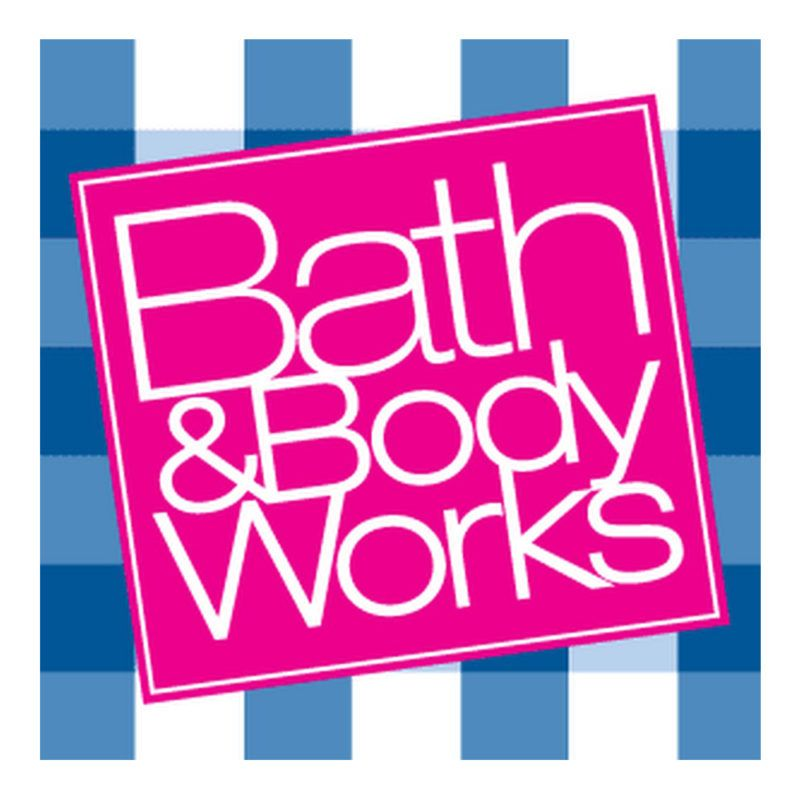
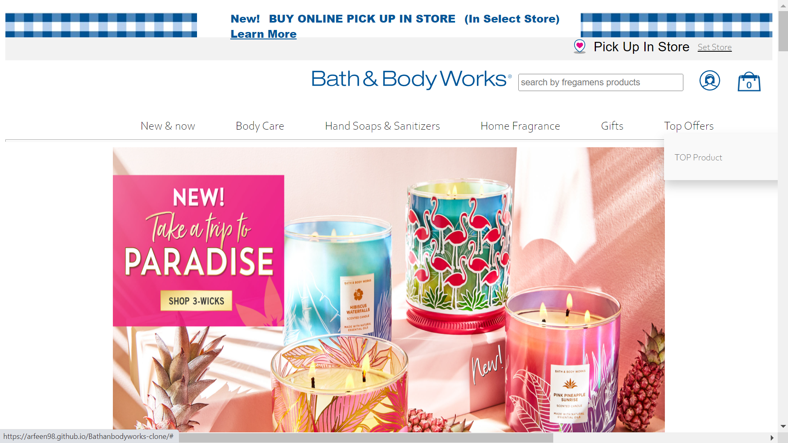

# Bath & Body Works(clone)
________________________________________
Project: Make a clone of Bath & Body Works website.

Cloned-Website: https://arfeen98.github.io/Bathanbodyworks-clone

Blog-Link:https://link.medium.com/UqCMu2uAoqb

In this project we have tried to manipulate Dom elements, Styling using CSS and tried to make website more dynamic and responsive. With our efforts and the technology that we have learned in Unit-2 in the Masai School, we were able to clone the website in 6 days with the same looking and some features.

# Technology Stack Used 🌟
•	HTML
•	CSS
•	JavaScript
•	BootStrap
   
For storing all data we used localStorage.
Snapshots 📷
•	 page (Home page)

 

•	Body care Page

  
•	Implement Sort By and Filters  Page
  
•   Shop By Category

•	Cartage
  
•	Signup & Login Page

 

How to run the Project
•	Open pages directory.
•	Open index.html using live server.

# End Notes 📑
In this project we have tried to  clone  the original website as much as possible. This entire journey of this Unit-2 construct week has given us 
experiences and we have learned lots of things by applying to the real website and it gave us a lot of confidence. Most of the features are added and functionality of the website is achieved by dom manipulation.

# Limitations
Pages are not responsive yet, those pages might not be properly visible on small screen devices as we were given only 6 days to clone the website.

